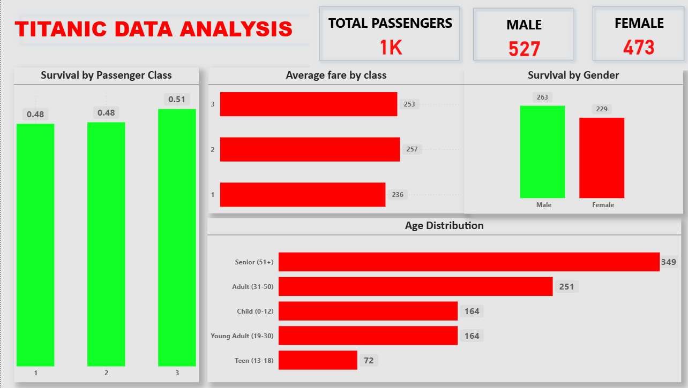

# Titanic Survival Analysis (Python + Power BI)

## Project Overview
This project analyzes the Titanic passenger dataset to understand survival patterns based on gender, passenger class, and age.  
Python was used for data cleaning and analysis, while Power BI was used to create an interactive dashboard.

---

## Objectives
- Determine the overall survival rate
- Compare survival rate between males and females
- Analyze survival across passenger classes
- Explore age distribution of passengers

---

## Tools & Technologies
- Python (Pandas, NumPy)
- Jupyter Notebook
- Power BI
- Git & GitHub

---

## Project Structure
```
titanic-survival-analysis
│
├── data
├── notebooks
├── scripts
├── images
└── powerbi
```

---

## Key Insights
- Females had significantly higher survival rate than males
- First class passengers survived more than lower classes
- Younger passengers had better survival chances

---

## Dashboard Preview


---

## How to Run the Project
1. Clone the repository
2. Install required libraries
3. Run the Jupyter notebook

```
pip install pandas numpy matplotlib seaborn
jupyter notebook
```

---

## Author
Olaniyi Ogunlade  
Aspiring Data Analyst
